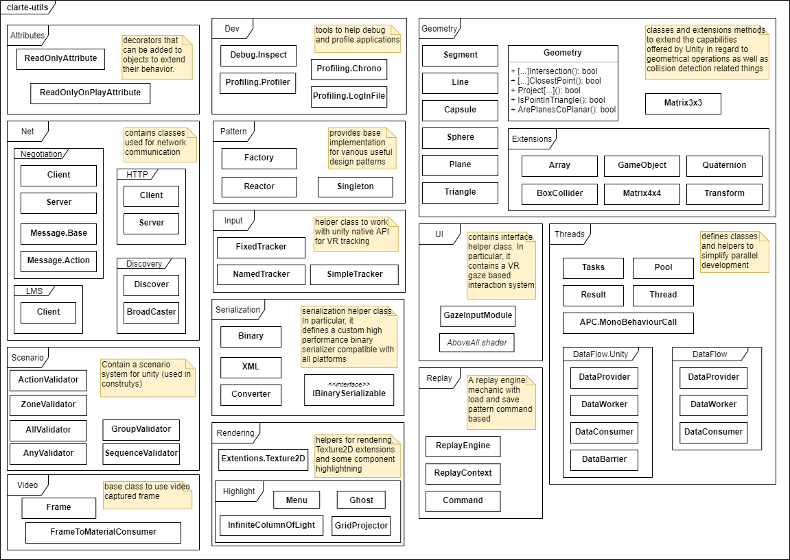
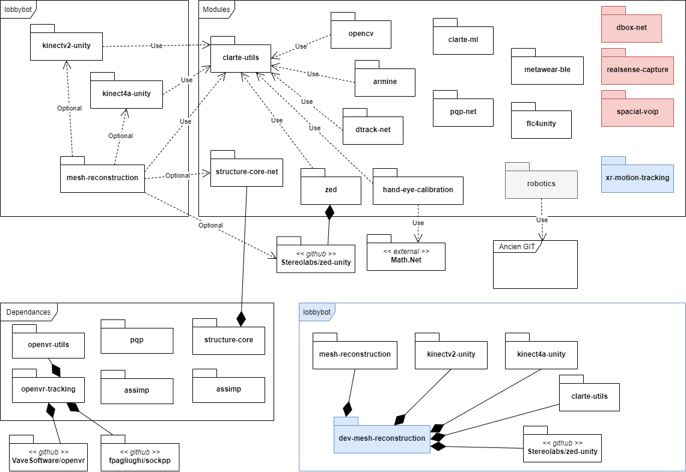

Clarte Utils
===============

This repository contains shared utility code. It only defines independent and
reusable classes / modules intended to be used in many projects. It depends on
[Unity UI package](https://docs.unity3d.com/Packages/com.unity.ugui@1.0/manual/index.html).

Content
===============

The following namespaces are defined:
- 'Attributes' defines class decorators that can be added to objects to extend
  their behavior.
- 'Backport' (deprecated) adds support for modern .NET types and classes to
  older versions of the framework.
- 'Dev' contains tools to help debug and profile applications.
- 'Geometry' adds classes and extensions methods to extend the capabilities
  offered by Unity in regard to geometrical operations (matricial operations
  for example), as well as collision detection related things.
- 'Input' defines helper class to work with unity native API for VR tracking.
- 'Net' contains classes used for network communication. In particular, it
  defines an HTTP server and client, as well as a multi-channel negotiation
  protocol for easy networking independant of Unity network stack. Also
  Contains classes to access to clarte LMS and auto discovering pairs.
- 'Pattern' provides base implementation for various useful design patterns.
- 'Serialization' contains all serialization helper class. In particular, it
  defines a custom high performance binary serializer compatible with all
  platforms (including hololens).
- 'Threads' defines classes and helpers to simplify parallel development. In
  particular, it defines a platform agnostic wrapper for threads that can be
  used on hololens. It also defines thread pool, future and execution
  demultiplexion utilities. Also contains Dataflow system to create a multi-
  threaded data worker pipeline, usefull to work on video frames for example
  a marker detection process.
- 'UI' contains interface helper class. In particular, it contains a VR gaze
  based interaction system for Unity GUI.
- 'Scenario' a scenario system for unity based on scene hierarchy.
- 'Video' contains base classes to use video captured in byte buffers.
- 'Rendering' contains extentions on Texture2D and some helpers component
  to highlight things in a VR experience.
- 'Replay' a replay engine mechanic with load and save pattern command based.

png files in this repository are editable with draw.io, do not forget to
to embded graph in png file when editing it.

Guidelines for contributions
===============

The guidelines for the authorized code are the following:
- Code only. No assets, DLL, or other files formats.
- Classes, static or extension methods.
- Components with no license / copyright / confidentiality issues. Everything
  must be usable in every project.
- Independent components. They should not depend on anything else, except if
  those dependencies are also included.
- Only 'utility' functions, i.e. which are used often and are rarely modified.
- Every component must be named explicitly, with meaningful namespaces.
  In particular, everything must at least reside in the "CLARTE" namespace.
  Extension methods must also be defined in a valid namespace to avoid
  polluting types with unwanted extensions methods.
- Code should not use Debug.Log functions. Errors should be returned explicitly
  by every functions. Users should have the possibility to choose what is
  logged, including severity and message formatting.
- Commented code. In particular, each public class or method must have
  comments following the C# XML conventions :
  https://docs.microsoft.com/en-us/dotnet/csharp/programming-guide/xmldoc/xml-documentation-comments
  https://docs.microsoft.com/en-us/dotnet/csharp/programming-guide/xmldoc/recommended-tags-for-documentation-comments

Other modules
===============

This graph show all modules available in [gitlab](https://gitlab.clarte.asso.fr/modules)
around clarte-utils and more. it also show [dependances](https://gitlab.clarte.asso.fr/dependances) which contains c++ modules usable as dll in unity. Finally it show a "dev-..."
unity project, classically used to develop a module.

Red color is used for modules that are empty, blue for unity project.
the black square show submodules link.

